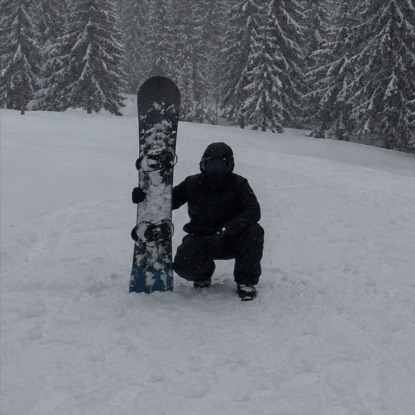

<picture>
  <source media="(prefers-color-scheme: dark)" srcset="https://readme-typing-svg.demolab.com?font=JetBrains+Mono&weight=500&size=20&duration=2500&pause=800&center=true&vCenter=true&width=734&height=70&lines=mov+rax%2C+%5Brbx%2B0x1C%5D;call+draw_esp;Reverse+engineering%2C+FullStack%2C+3D&color=FFFFFF" />
  
</picture>

---

I reverse engineer games, build the web tooling around them, and model in 3D.

Professionally I am a full-stack developer at naPorta, a logtech that gets online
orders into communities and rural areas ordinary carriers do not serve. I work
across the whole stack there: TypeScript and NestJS on the backend, React on the
operations side, Flutter for the couriers' app, over Postgres and Google Cloud.
Routes and stops run on Mapbox and Google Maps. On the backend I build modules
split into domain, application and infrastructure layers, with CQRS and
event-driven flows over Pub/Sub; on mobile, feature-first Flutter with BLoC.

Outside work I stay on the low-level side: pulling binaries apart in Ghidra and
x64dbg, chasing pointer chains, writing the C++ that hooks into them. It is the
same instinct as the day job, really: work out how something behaves from the
outside in. Blender is where the visuals come from.

 

<h3>Tech Arsenal & Tools</h3>

---

      

    

         

         

   

     

    

  

<!--⠀⠀⠀⠀⠀⠀⠀⠀⠀⠀⠀⠀⠀⠀⠀⠀⠀⠀⠀⠀⠀⠀⠀⠀⠀⠀⠀⠀⠀⠀
              ⠙⠻⢿⣿⣿⣿⣿⣿⣿⣿⣿⣿⣿⣿⠀⠀⠀
                  ⠀⠉⠉⠛⠻⣿⣿⣿⡿⠟⠉⠀⠀⠀
                  ⠀⠀⠀⠀⠀⣾⣿⣿⣿⣟⠀⠀⠀⠀⠀⠀
⠀                  ⠀⠀⠀⠀⠹⢿⣿⣿⣿⣷⣶⣦⣄⠀⠀
⠀⠀⠀⠀⠀⠀                  ⠀⠀⠉⠛⠻⢿⣿⣿⣿⡄⠀
⠀⠀⠀⠀⠀⠀⠀                 ⠀⠀⠀⠀⠀⠀⠀⠈⢻⣿⡇⠀
⠀⠀⠀⠀⠀⠀⠀⠀⠀                 ⠀⠀⠀⠀⠀⠀⣸⠟⠀⠀
⢀⣤⣤⣤⣤⡄⠀⣤⣤⣤⣤⣤⣤⣤⣤⣤⣤⣤⣤⣤⣤⣤⣤⠀⣄⢁⣄⠀⠀
⢸⣿⣿⣿⣿⡇⠀⣿⣿⣿⣿⣿⣿⣿⣿⣿⣿⣿⣿⣿⣿⣿⣿⠀⣿⢸⣿⠀⠀
⠈⠛⠛⠛⠛⠃⠀⠛⠛⠛⠛⠛⠛⠛⠛⠛⠛⠛⠛⠛⠛⠛⠛⠀⠋⠈⠋
-->
